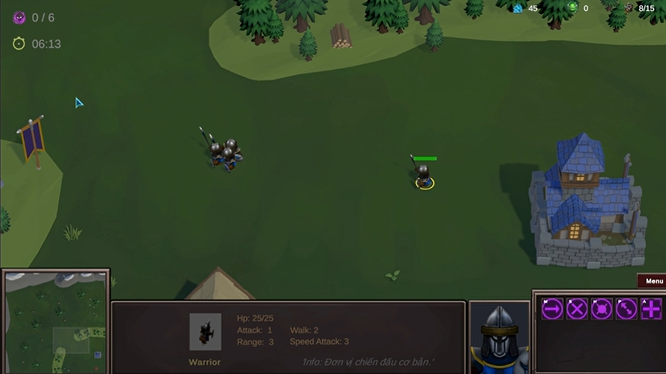
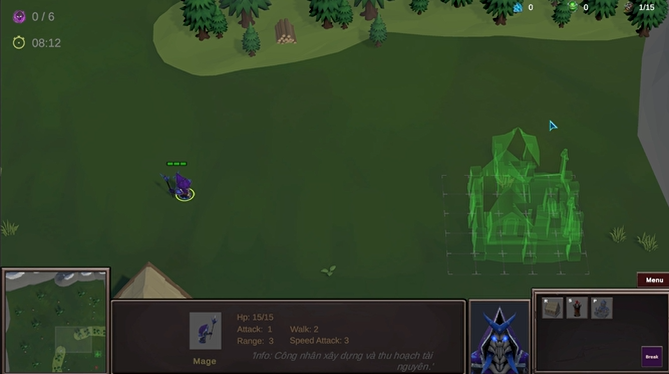

# FireNBM - RTS Game

🔥 **FireNBM** là một trò chơi chiến thuật thời gian thực (**RTS**) lấy cảm hứng từ *StarCraft 2*, nơi người chơi xây dựng căn cứ, quản lý tài nguyên và điều khiển quân đội chiến đấu để giành chiến thắng!

## 📷 Hình ảnh minh họa

  
  

## 🎬 Video Demo 
  - [Video demo game FireNBM trên YouTube](https://youtu.be/f_69SS5DXQw)

## 🕹️ Cách chơi
1️⃣ **Xây dựng căn cứ** – Đặt công trình bằng UI hoặc phím tắt.  
2️⃣ **Thu thập tài nguyên** – Điều khiển worker để gather tài nguyên.  
3️⃣ **Huấn luyện quân đội** – Xây dựng nhà lính và tạo quân.  
4️⃣ **Chiến đấu** – Ra lệnh quân đội tấn công bằng Action System.  
5️⃣ **Tiêu diệt kẻ địch** – Tiêu diệt đủ số địch trong thời gian cho phép để giành chiến thắng.  

## 🚀 Tính năng chính
✅ **Xây dựng căn cứ** – Tạo công trình và nâng cấp sức mạnh.  
✅ **Quản lý tài nguyên** – Thu thập tài nguyên để mở rộng đội quân.  
✅ **Chiến thuật thời gian thực** – Điều khiển quân đội linh hoạt.  
✅ **Hệ thống điều khiển** – Thực hiện lệnh bằng UI hoặc phím nóng.

## 🎮 Các lệnh cơ bản  
🔹 **Move** – Di chuyển đến vị trí chỉ định.  
🔹 **Stop** – Dừng ngay lập tức.  
🔹 **Hold Position** – Giữ vị trí cố định.  
🔹 **Patrol** – Tuần tra giữa hai điểm.  
🔹 **Attack** – Tấn công kẻ địch.  
🔹 **Gather** – Thu thập tài nguyên.  
🔹 **Build** – Xây dựng công trình.  
🔹 **CreateWorker** – Tạo công nhân xây dựng.  
🔹 **CreateUnitBase** – Tạo lính chiến đấu cơ bản.  

## 🏗️ Hệ thống và kiến trúc  
- **Building System** – Hệ thống xây dựng với trạng thái _"Under Construction"_ và _"Completed"_.  
- **Selector System** – Chọn đơn vị và quản lý nhóm quân cùng với đó là công trình, công trình đang xây dựng.  
- **Action System** – Xử lý các lệnh của người chơi thông qua UI hoặc hotkey.  
- **Input System** – Điều phối các đầu vào của người dùng (tránh xung đột khi nhấn cùng một đầu vào).  
- **Camera Manager** – Điều khiển camera với nhiều phương thức:  
  - **Panning** – Di chuyển camera bằng phím mũi tên hoặc mép màn hình.  
  - **Zooming** – Nhấn `Alt` + lăn chuột để thu phóng.  
  - **Edge Scrolling** – Di chuyển camera khi chuột chạm mép màn hình.  

## 🛠️ Mẫu thiết kế sử dụng  
- State, Command, Composite, Flyweight, Factory, Observer, Object Pooling, Singleton.

## 🎯 Vai trò & Đóng góp  
- **Lập trình chính** – Thiết kế hệ thống game, quản lý trạng thái, AI.  
- **Xây dựng gameplay** – Điều khiển quân đội, cơ chế chiến đấu.  
- **Thiết kế hệ thống tài nguyên** – Thu thập, tiêu hao, nâng cấp.  
- **Phát triển UI/UX** – HUD, bảng điều khiển chiến thuật.  

## 📌 Ghi chú  
- Game đang trong quá trình phát triển, sẽ bổ sung nhiều tính năng hơn! 🚀

## 📞 Liên hệ  
💼 **Nguyễn Bá Minh**  
📧 Email: nguyenbaminh818@gmail.com   

